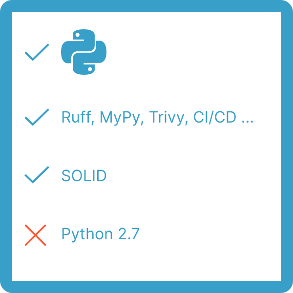

PYthon GuideLines
---

These are comprehensive guidelines for Python backend/full-stack development, consisting of the following:

1. [Code style](./code-style.md)
1. [Architecture guide](./architecture-guide.md)
1. Local development guide
1. [CI/CD pipeline](https://github.com/insani7y/moscow-python-conf-2024)

Why this project?
----

Because there are a lot of guidelines, but not a single one of them is comprehensive enough for most of the use-cases in modern backend development. Here we collect best of our guides to help maintain big codebases in good shape. Without hard and tricky words and rules.
